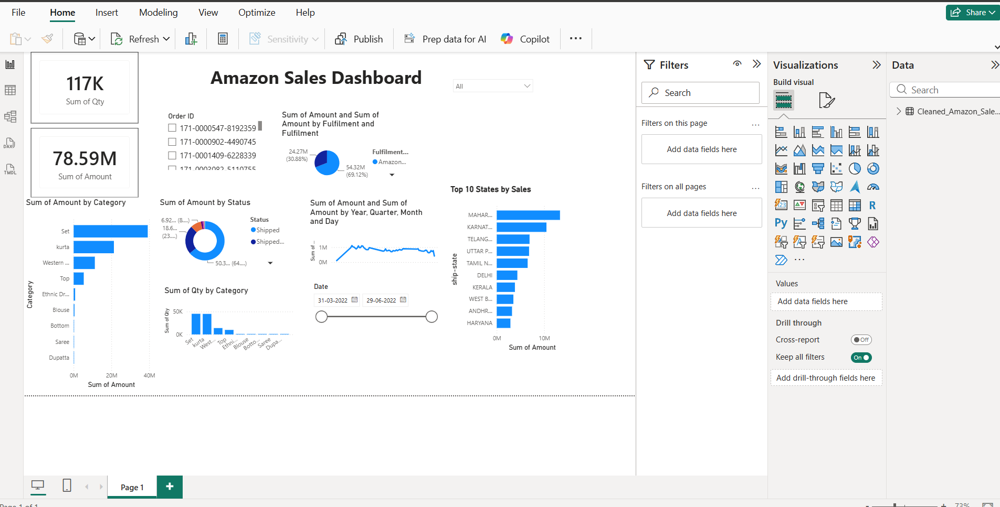

E-Commerce Sales Analytics Dashboard

Project Overview

This project analyzes Amazon e-commerce sales data to identify sales trends, top-performing categories, fulfilment methods, and high-performing states.

Dataset

The project uses Amazon sales data containing order details, dates, categories, quantities, amounts, fulfilment information, and shipping locations.

Technologies Used

- Python
- Pandas
- SQL
- SQLite
- Power BI
- Excel/CSV

Python Analysis

Python and Pandas were used for data cleaning, preprocessing, exploratory data analysis, and identifying sales patterns.

SQL Analysis

SQL queries were used to calculate:

- Total Sales
- Total Orders
- Average Order Value
- Sales by Category
- Sales by Fulfilment
- Sales by State
- Sales by City

Power BI Dashboard

The Power BI dashboard contains:

- Total Quantity KPI
- Total Sales KPI
- Sales by Category
- Sales by Status
- Sales by Fulfilment
- Sales Trend by Date
- Top 10 States by Sales
- Date Slicer

Key Features

- Interactive dashboard
- Top 10 state analysis
- Date-based filtering
- Sales and quantity KPIs
- Category and fulfilment analysis

Project Outcome

The dashboard helps understand e-commerce sales performance and provides insights into categories, locations, fulfilment methods, and sales trends.

Dataset

This project uses Amazon e-commerce sales data for sales analysis and dashboard development.

Dataset Files

The original and cleaned CSV files are stored locally because they exceed GitHub's file upload size limit.

- "Amazon_Sales_Report.csv" — Original dataset
- "Cleaned_Amazon_Sales_Report.csv" — Cleaned dataset

Dataset Contains

- Order ID
- Order Date
- Status
- Fulfilment
- Category
- Quantity
- Amount
- Shipping City
- Shipping State
- Shipping Information

The cleaned dataset was used for Python analysis, SQL analysis, and the Power BI dashboard.

## Power BI Dashboard

